# 创建微软Azure深度学习虚拟机并进行配置 (Create Microsoft Azure VM and edit some configurations for deep learning)

一个关于创建Azure虚拟机、挂载硬盘、安装NVIDA显卡驱动与CUDA、创建用户的教程

A tutorial to teach you how to create an Azure VM for deep learning, mount the hard drivers, install NVIDIA GPU driver and CUDA and CUDNN, and create user accounts.

> 一共有5.5个部分
> + A. 创建微软Azure深度学习虚拟机
> + B. 硬盘挂载
> + C. 安装CUDA
> + D. 安装CUDNN
> + (D+E)/2. 修改/data0权限为777（/data0为本虚拟机用户大型数据存储文件夹）
> + E. 创建用户

***

## A. 创建微软Azure深度学习虚拟机

可以参考[官方文档](https://docs.microsoft.com/zh-cn/azure/virtual-machines/linux/quick-create-portal)

For English version, please see the offical document [here](https://docs.microsoft.com/en-us/azure/virtual-machines/linux/quick-create-portal)

#### 1. 选择Ubuntu Server

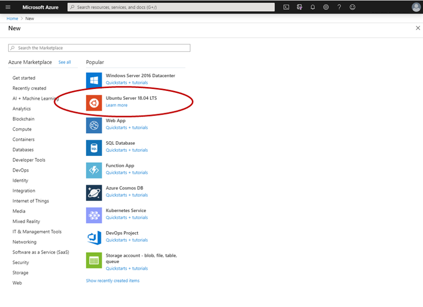

#### 2. 一些设置（虚拟机默认端口是22）

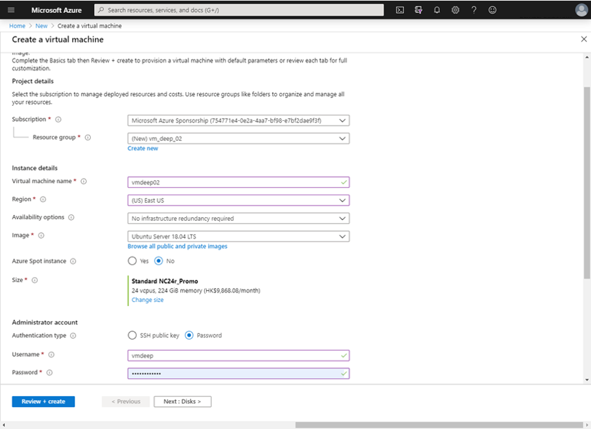

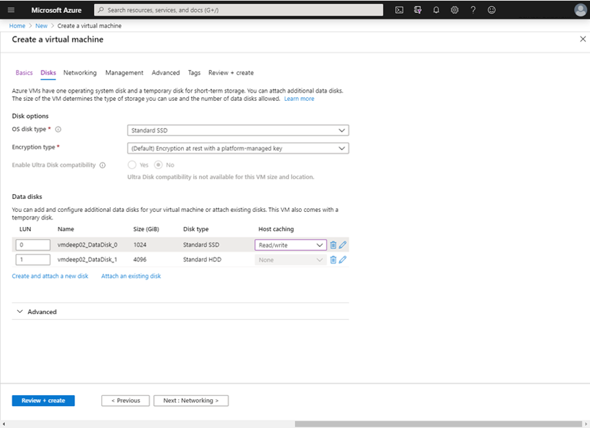

#### 3. 点击“Create”，成功创建（记得看一下价格）

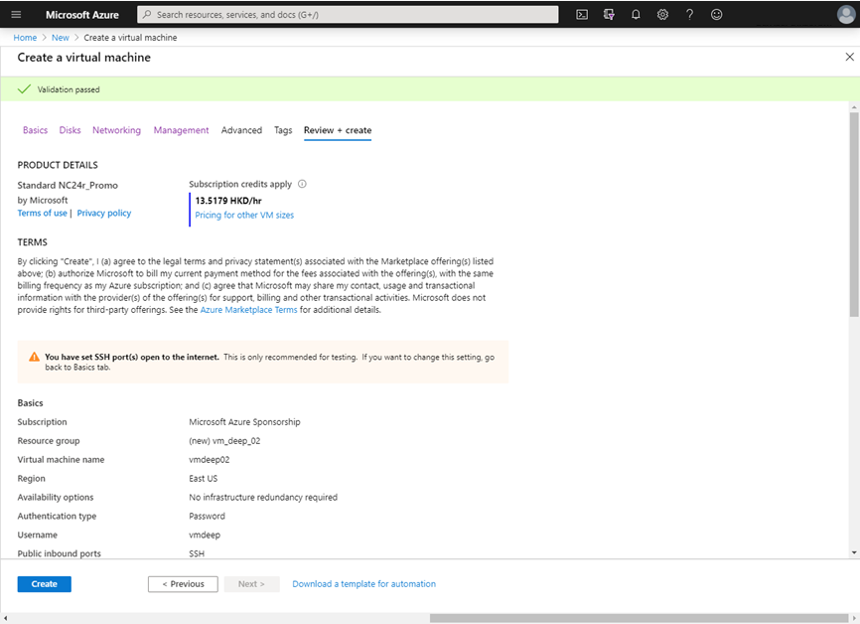

#### 4. 设置inbound security rule（e.g. 此处设置Port 1997则可以通过1997端口使用Jupyter Notebook）

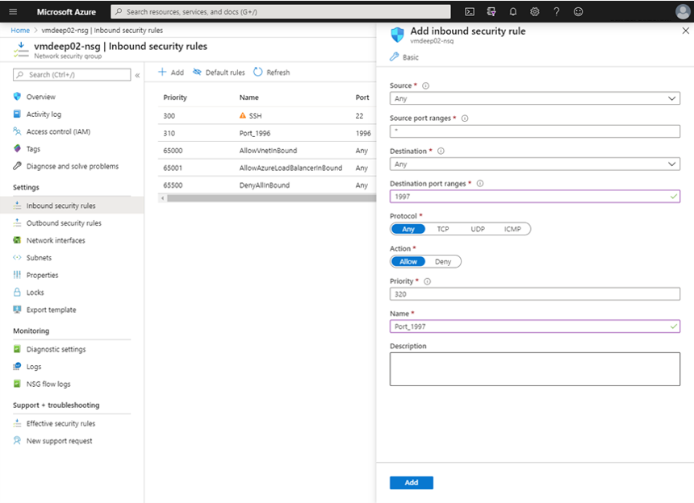

#### 5. 查看虚拟机基本信息

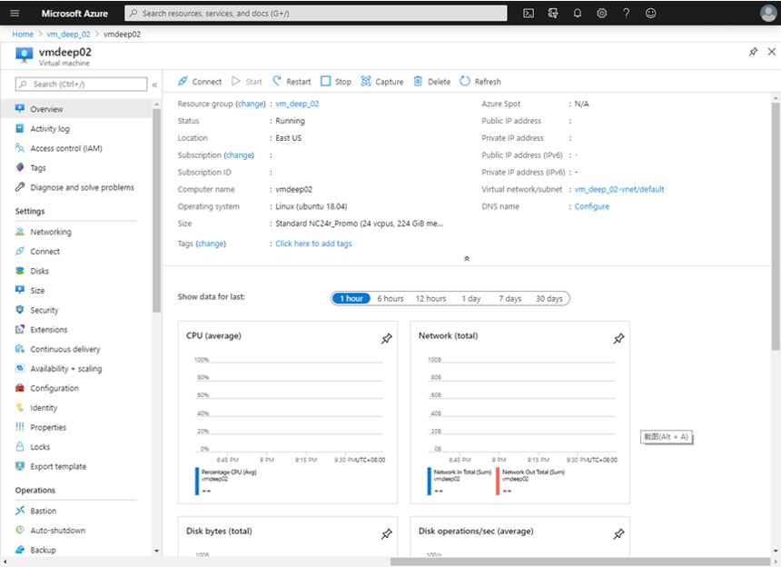

***

## B. 硬盘挂载

#### 1. 查看硬盘信息

输入命令1：

```
sudo fdisk -l
```

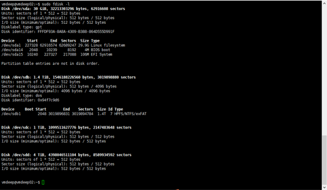

输入命令2：

```
df -lh
```

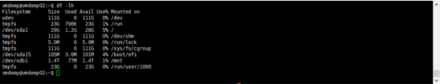

#### 2. 格式化

可见待挂载的硬盘为/dev/sdc和/dev/sdd，此处以/dev/sdc为例；本教程不对硬盘进行分区，直接格式化；可见待挂载的硬盘为/dev/sdc和/dev/sdd，此处以/dev/sdc为例；本教程不对硬盘进行分区，直接格式化； mkfs命令用来在特定的分区创建linux文件系统，常见的文件系统有ext2，ext3，ext4, vfat

输入命令：

```
sudo mkfs.ext4 /dev/sdc
```

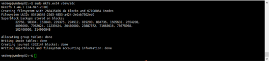

#### 3. 挂载

创建文件夹/home/users（此文件夹用于创建本虚拟机用户）作为硬盘挂载的文件夹（此处为示例，可将硬盘挂载在其他文件夹下）

输入命令：

```
sudo mkdir /home/users
```

将/dev/sdc挂载在/home/users下

输入命令：

```
sudo mount /dev/sdc /home/users
```

#### 4. 查看

输入命令

```
df -h
```

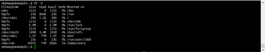

#### 5. 配置开机自动挂载

打开/etc/fstab并进行修改

输入命令：

```
sudo nano /etc/fstab
```

在文件末尾加入

```
/dev/sdc        /home/users     ext4    defaults        0       0
```

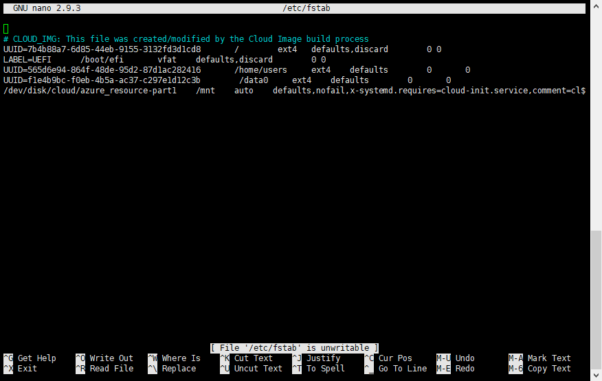

#### 6. 重启系统

输入命令：

```
sudo reboot
```

#### 7. 仿照上述操作，将/dev/sdd挂载在/data0（/data0为本虚拟机用户大型数据存储文件夹）下，用以存放数据

***

## C. 安装NVIDIA显卡驱动（使用 Ubuntu 软件仓库中的稳定版本安装）

#### 1. 查看NVIDIA显卡型号

输入命令：

```
lspci | grep -i nvidia
```

#### 2. 安装前准备

输入命令：

```
ubuntu-drivers devices
```

或许提示`Command 'ubuntu-drivers' not found, but can be installed with: sudo apt install ubuntu-drivers-common`

则首先
```
sudo apt-get update
```

然后
```
sudo apt install ubuntu-drivers-common
```

再运行
```
ubuntu-drivers devices
```

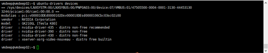

#### 3. 安装

输入命令：

```
sudo ubuntu-drivers autoinstall
```

#### 4. 重启系统

输入命令：

```
sudo reboot
```

***

## C. 安装CUDA

#### 1. 参阅[NVIDIA官网](https://developer.nvidia.com/cuda-toolkit)

#### 2. 我需要安装CUDA 10.1，故选择如下（我选择runfile安装方式）

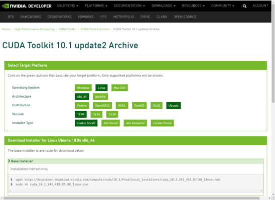

#### 3. 运行网页中的Installation Instructions

输入命令：

```
wget http://developer.download.nvidia.com/compute/cuda/10.1/Prod/local_installers/cuda_10.1.243_418.87.00_linux.run

sudo sh cuda_10.1.243_418.87.00_linux.run
```

#### 4. 选择不安装Driver，安装CUDA Toolkit，CUDA Samples，CUDA Demo Suite， CUDA Documentation

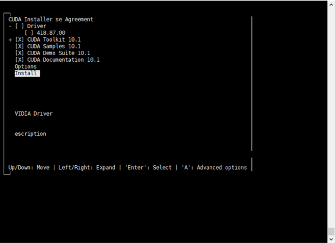

#### 5. 添加环境变量

（参考https://docs.nvidia.com/cuda/cuda-installation-guide-linux/index.html#post-installation-actions中7. Post-installation Actions）

（亦可参考如下网址设置system-wide的环境变量 https://www.pugetsystems.com/labs/hpc/How-To-Install-CUDA-10-1-on-Ubuntu-19-04-1405/）

输入命令打开bashrc

```
nano .bashrc
```

在bashrc中添加以下两句话

```
export PATH=/usr/local/cuda-10.1/bin${PATH:+:${PATH}}

export LD_LIBRARY_PATH=/usr/local/cuda-10.1/lib64${LD_LIBRARY_PATH:+:${LD_LIBRARY_PATH}}
```

输入命令

```
source .bashrc
```

***

## D. 安装CUDNN

#### 1. 前往[官方网站](https://developer.nvidia.com/cudnn)下载

#### 2. 我下载的文件为cudnn-10.1-linux-x64-v7.6.5.32.solitairetheme8

#### 3. 解压

输入命令

```
cp cudnn-10.1-linux-x64-v7.6.5.32.solitairetheme8 cudnn-10.1-linux-x64-v7.6.5.32.tgz

tar -xvf cudnn-10.1-linux-x64-v7.6.5.32.tgz
```

#### 3. 安装

输入命令

```
sudo cp cuda/include/cudnn.h /usr/local/cuda/include/

sudo cp cuda/lib64/libcudnn* /usr/local/cuda/lib64/

sudo chmod a+r /usr/local/cuda/include/cudnn.h

sudo chmod a+r /usr/local/cuda/lib64/libcudnn*
```

#### 4. 查看CUDNN版本

输入命令

```
cat /usr/local/cuda/include/cudnn.h | grep CUDNN_MAJOR -A 2
```

***

## (D+E)/2. 修改/data0权限为777（/data0为本虚拟机用户大型数据存储文件夹）

输入命令

```
sudo chmod 777 /data0
```

***

## E. 创建用户

#### 1. 新增用户组 （e.g. normalusers）

输入命令

```
sudo groupadd normalusers
```

#### 2. 创建用户 （e.g. 在/home/users下创建用户wangad）

输入命令

```
sudo useradd -g normalusers -d /home/users/wangad -m wangad
```

#### 3. 设置密码 （e.g. 对于用户wangad设置其密码）

输入命令

```
sudo passwd wangad
```
